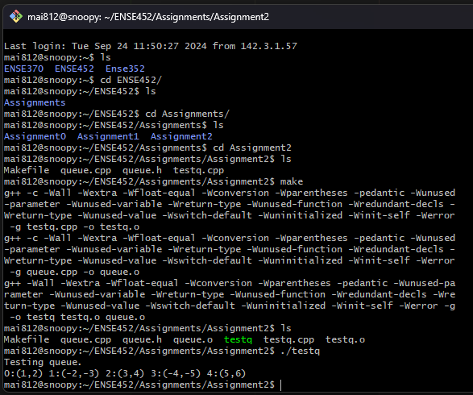

# Linked List

<div align="center">

This assignment implements a queue using a linked-list in C++, with the added functionality to insert elements at any position and includes testing for queue operations such as insertion, search, and removal.

</div>

## Important notes

- I would like to inform the marker that I have used the code provided by Professor Karim Naqvi on urcourses. I have kept his code and comments in my submission and made only the necessary changes to ensure that the program work. Since a significant portion of his code and comments remains in my submission, I thought it was important to declare this. For ex. in the queue.cpp file, I only modified the insert method and kept the rest of the code same.
- Also, I used the test case example provided on the assignment pdf handout. 

## To run the program on Snoopy:

Make sure you have the files (`queue.cpp`, `queue.h`, `testq.cpp` and `Makefile`) in your directory, then run the make command:

```sh
make
```

Then run the `testq` file to check the tests results.


### Below is the picture which shows the program result after I ran it:

<div align="center">



</div>
