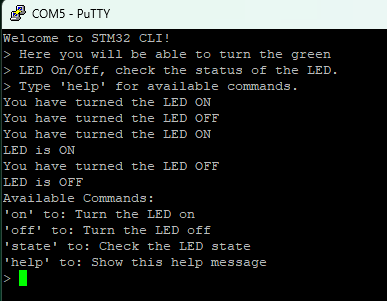

# Lab 2: STM32 UART and CLI Implementation

This lab focuses on setting up UART communication on the STM32F103RBT6 microcontroller and implementing a simple Command Line Interface (CLI) to control an onboard LED. 

## Features

- UART communication via USART2.
- CLI with the following commands:
  - `on`: Turn the onboard LED on.
  - `off`: Turn the onboard LED off.
  - `state`: Query the current state of the LED.
  - `help`: Display available commands.

## Files

- <b>main.c</b>: Contains the main loop and initialization functions.
- <b>cli.c/cli.h</b>: Implements the CLI for receiving and processing commands via UART.

## Example Output

Here's a screenshot of the CLI running:

## How to Run

1. Clone the repository.
2. Open the project in **STM32CubeIDE**.
3. Build the project and flash it to the STM32 board.
4. Use PuTTY to interact with the CLI via the serial interface.

