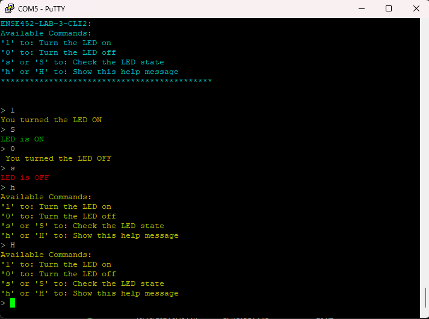

# Lab 3: Command Line Interface Part 2

This lab focuses on setting up UART communication on the STM32F103RBT6 microcontroller and implementing a better version of Command Line Interface (CLI) to control an onboard LED.

## Features

- UART communication via USART2.
- CLI with the following commands:
  - `1`: Turn the onboard LED on.
  - `0`: Turn the onboard LED off.
  - `s` or `S`: Query the current state of the LED.
  - `h` or `H`: Display available commands.

## Example Output

Here's a screenshot of the CLI running:

## How to Run

1. Clone the repository.
2. Open the project in **STM32CubeIDE**.
3. Build the project and flash it to the STM32 board.
4. Use PuTTY to interact with the CLI via the serial interface.
